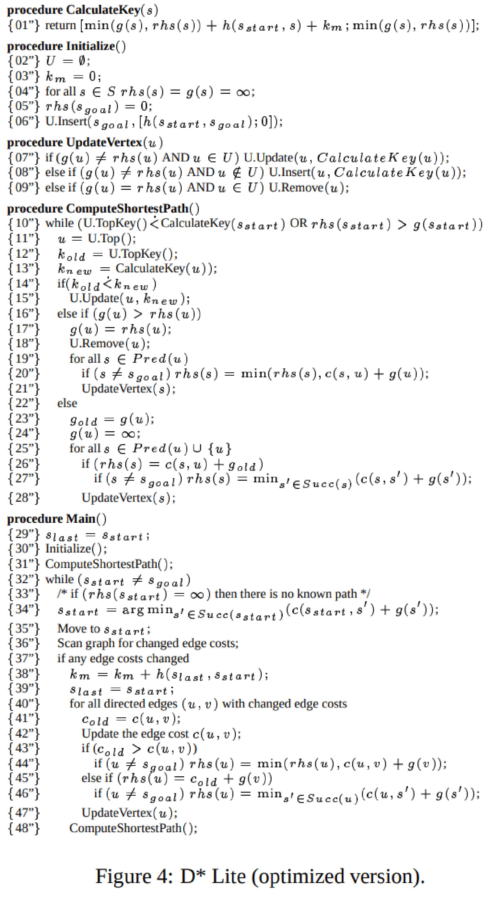

# DLite

## Зависимости
 pip install pygame
 pip install numpy

### Команды
 [Пробел] - робот делает шаг по траектории
 [левый клик] - ставим препятствие на клетке
 [правый клик] - убираем препятсвие с клетки
 [del] - сохраняем текущую карту в map.txt
 [escape] - подгружаем карту из map.txt
 s_start, s_goal, радиус видимости можно менять в main.py

### Значения цветов
 Синий - Спроектированный путь
 Зеленый - Целевая вершина
 Серый - Препятсвие
 Белый - Свободная клетка

### Краткое описание
В этом проекте мной был реализован алгоритм D Lite. Алгоритм похож на работу LifeLongPlanning A* тольуо учитывает ограничение обзора агента. В отличие от алгоритма A* при изменении карты мы перестраиваем не все веса, а только корректируем некоторые из них. Полный алгоритм досупен ниже

### Псевдо-код, D Lite optimized version

